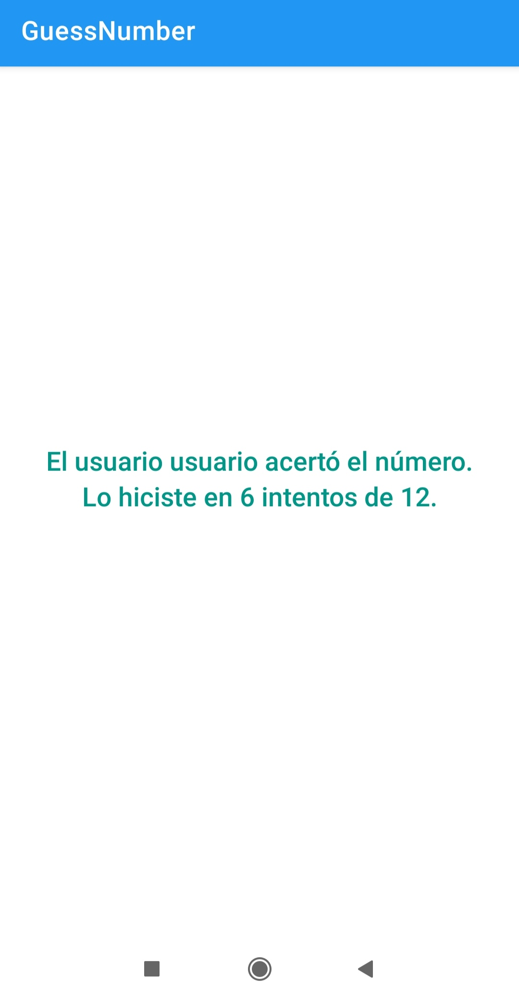

<h1>GuessNumber</h1>

El programa consiste en adivinar un número aleatorio del 1 al 100 en un número de intentos
dado por el usuario.

En esta actividad he practicado todo lo que he aprendido hasta el momento en este módulo.
Como pasar información de unas Activities a otras con las clases Bundle e Intent,
trabajar con los elementos de la vista desde código con la clase Binding
y a guardar el estado de una Activity después de ser rotada.

A continuación se muestra una serie de capturas de la aplicación.

 

